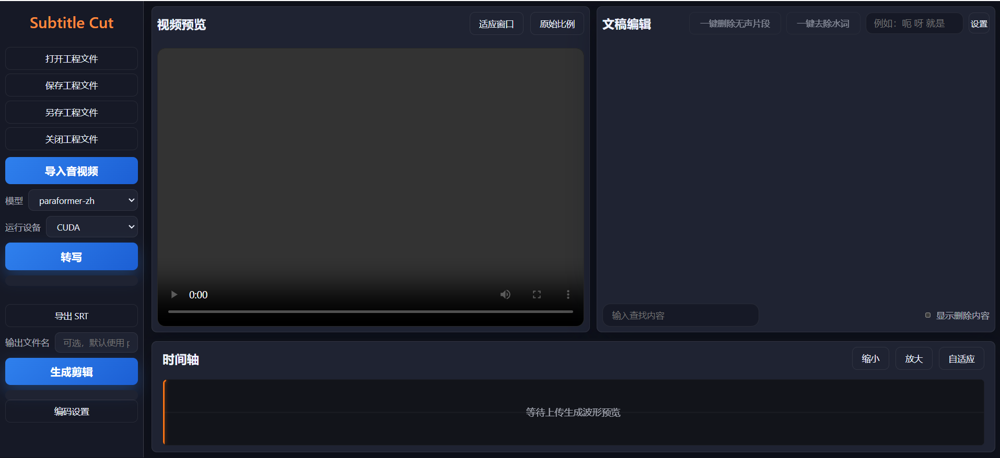

---

```markdown
<div align="center">

# 🎬 Subtitle-Cut  
_基于字级精确识别与对齐的 AI 自动字幕剪辑工具_  
AI-powered subtitle cutting tool with word-level precision and Paraformer-based ASR.

---

[](https://www.python.org/downloads/)
[](LICENSE)
[](https://github.com/foxmooner2021/subtitle-cut)
[](https://developer.nvidia.com/cuda-toolkit-archive)

---


<br/>

</div>

---

## ✨ 项目简介 | Overview

**Subtitle-Cut** 是一个轻量级的本地化 AI 字幕剪辑工具，  
可基于语音识别结果自动生成、剪切和同步视频字幕。  

- 🎧 基于 **Paraformer (阿里巴巴)** 的字级精准 ASR  
- 🧩 完全离线，无需联网  
- 🪄 支持批量处理与时间线可视化  
- 🧠 可扩展自定义模型与脚本  

---

## ⚙️ 环境配置 | Setup Instructions

### 0️⃣ 解压项目 / Unpack Project  
将项目文件夹解压到任意位置，例如 `E:\subtitle-cut\`  
Extract the project folder to any path, e.g. `E:\subtitle-cut\`

---

### 1️⃣ 安装 Python 3.11 / Install Python 3.11  
安装包位于 `subtitle-cut\third_party\`  
安装时**保留 “py launcher” (默认勾选)** 或 **勾选 “Add Python to PATH”**（至少一种）

Python installer is included under `third_party`.  
During setup, **keep “py launcher” checked** or **enable “Add Python to PATH”**.

---

### 2️⃣ 安装 CUDA 11.8（可选） / Optional: Install CUDA 11.8 for GPU  
若需 GPU 加速，请安装 **NVIDIA CUDA 11.8**：  
🔗 [CUDA Toolkit Archive – NVIDIA Developer](https://developer.nvidia.com/cuda-toolkit-archive)

安装时选择 **“Express”** 或 **“Custom”** 模式均可；  
若系统已有更新版驱动，可仅装 Toolkit。  
After installation, `torch==2.3.1+cu118` and `onnxruntime-gpu` will load correctly.

---

### 3️⃣ 安装 cuDNN（CUDA 11.8 配套） / cuDNN for CUDA 11.8  
CUDA 11.8 对应的 cuDNN 版本为 **8.9.x (8.9.0 ~ 8.9.7)**  
🔗 [cuDNN Archive – NVIDIA Developer](https://developer.nvidia.com/rdp/cudnn-archive)

解压后，将以下目录复制到 CUDA 安装路径：
```

bin      →  C:\Program Files\NVIDIA GPU Computing Toolkit\CUDA\v11.8\bin
include  →  ...\include
lib      →  ...\lib\x64

```
或设置环境变量 `CUDNN_PATH`。  
After copying, PyTorch and ONNX Runtime will properly detect cuDNN.

---

### 4️⃣ 下载并配置 FFmpeg / Install FFmpeg  
下载 **FFmpeg 免安装版（zip）**：  
🔗 [https://ffmpeg.org/download.html](https://ffmpeg.org/download.html)

将 `ffmpeg\bin` 下的所有文件复制到：
```

subtitle-cut\third_party\ffmpeg\bin

````

若需自定义路径，可打开 `install.bat` 搜索 `ffm` 关键字自行修改。  
否则直接复制覆盖默认目录即可。

> 💡 项目本身不分发 FFmpeg；用户需自行下载。

---

### 5️⃣ 初始化虚拟环境 / Create Virtual Environment  
在项目目录下运行：
```bash
install.bat
````

该脚本会创建虚拟环境并自动安装依赖。

---

### 6️⃣ 启动项目 / Run the App

```bash
run_webapp.bat
```

程序会在首次运行时自动下载离线模型，
也可提前下载模型包并解压到 `/models/`。

---

### 7️⃣ （可选）使用 ImDisk Toolkit 提升性能 / Optional: ImDisk Toolkit for RAM Disk

**ImDisk Toolkit** 可将部分内存虚拟为临时磁盘，用于加速视频读写。
该工具未随项目分发，请用户自行安装：
🔗 [https://sourceforge.net/projects/imdisk-toolkit/](https://sourceforge.net/projects/imdisk-toolkit/)

安装后，将安装路径加入系统 PATH。

---

### 💡 常见问题 / Tips

* 若提示 `torch 未检测到 CUDA`，请确认 CUDA 与 cuDNN 路径正确。
* 若提示 `ffmpeg not found`，请检查 `third_party/ffmpeg/bin/ffmpeg.exe` 是否存在。
* 首次运行模型加载较慢属正常现象。

---

## 🧩 模型与依赖 | Models & Dependencies

| 模块              | 用途       | 来源                          |
| --------------- | -------- | --------------------------- |
| Paraformer      | 中文语音识别模型 | Alibaba FunASR (Apache-2.0) |
| ONNX Runtime    | 推理加速引擎   | Microsoft (MIT)             |
| FFmpeg          | 音视频处理    | 用户自备 (LGPL/GPL)             |
| Flask / FastAPI | Web 后端   | PyPI (MIT/BSD)              |

---

## 💡 可选依赖 | Optional Components

### 🧠 ImDisk Toolkit

* 用于创建虚拟磁盘，加速视频缓存读写
* 未随项目分发，需自行下载
* 官方链接 🔗 [https://sourceforge.net/projects/imdisk-toolkit/](https://sourceforge.net/projects/imdisk-toolkit/)

---

## 📂 目录结构 | Directory Layout

```
subtitle-cut/
├─ data/                # 示例数据 / 运行时缓存
├─ models/              # 离线模型目录
├─ src/                 # 核心源代码
├─ third_party/         # 第三方依赖路径占位（不含二进制）
│   └─ ffmpeg/bin/
├─ install.bat
├─ run_webapp.bat
├─ requirements.txt
├─ pyproject.toml
├─ LICENSE
└─ README.md
```

---

## 📜 许可证 | License

本项目源代码基于 **MIT License** 开源发布。
The source code of this project is released under the **MIT License**.

> Paraformer (Apache-2.0) 与 FFmpeg (LGPL) 保留其原始授权方式。
> Paraformer and FFmpeg retain their original licenses.

📄 详情见 [third_party/LICENSES.md](third_party/LICENSES.md)

---

## ❤️ 致谢 | Acknowledgements

* [Alibaba DAMO Academy – FunASR / Paraformer](https://github.com/alibaba-damo-academy/FunASR)
* [Microsoft – ONNX Runtime](https://github.com/microsoft/onnxruntime)
* [FFmpeg Project](https://ffmpeg.org)
* 社区开发者与贡献者们 🙏

---

<div align="center">

*Developed with ❤️ by **foxmooner2021*** <sub>Thank you for supporting open-source AI tools.</sub>

</div>
```

---
